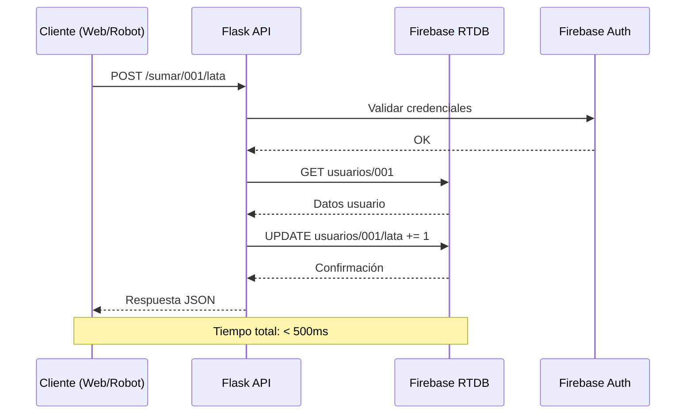

# Base de Datos Firebase Realtime Database
Se uitlizó la base de datos Firebase Realtime Database ingresando la estructura siguiente
- `usuarios/`
  - `[ID_USUARIO]/`
    - `fecha_creacion`: "YYYY-MM-DD HH:MM:SS"
    - `lata`: 0
    - `nombre`: ""
    - `tetra`: 0
    - `vidrio`: 0

Cada usuario tiene esta misma estructura. Para acceder a la base de datos se necesita la llave de otra forma, no sería posible. Además se usa la librería firebase_admin y de esta credentials y db.
## Arquitectura de Datos

El sistema utiliza **Firebase Realtime Database** como solución de almacenamiento en tiempo real, elegida por su capacidad de sincronización inmediata y facilidad de integración con aplicaciones web y móviles.

### Estructura Jerárquica

```
Firebase Realtime Database
└── usuarios/                          # Nodo raíz de usuarios
    ├── 001/                           # ID único del usuario (RFID)
    │   ├── fecha_creacion: "2025-01-15 10:30:00"
    │   ├── nombre: "ANA"
    │   ├── lata: 15
    │   ├── vidrio: 8
    │   └── tetra: 12
    ├── 002/
    │   ├── fecha_creacion: "2025-01-16 14:20:00"
    │   ├── nombre: "SAM"
    │   ├── lata: 22
    │   ├── vidrio: 5
    │   └── tetra: 3
    └── [otros_usuarios...]
```

## Diseño del Esquema

### Nodo: `usuarios`
Es el nodo principal que contiene todos los usuarios registrados en el sistema.

### Campos por Usuario

| Campo | Tipo | Descripción | Ejemplo |
|-------|------|-------------|---------|
| **`user_id`** | String (clave) | Identificador único (normalmente RFID) | `"001"`, `"RFID_123ABC"` |
| **`nombre`** | String | Nombre del usuario | `"ANA"` |
| **`fecha_creacion`** | String | Fecha y hora de registro inicial | `"2025-01-15 10:30:00"` |
| **`lata`** | Integer | Contador de latas recicladas | `0` |
| **`vidrio`** | Integer | Contador de vidrio reciclado | `0` |
| **`tetra`** | Integer | Contador de Tetra Pak reciclado | `0` |

## Configuración de Seguridad

### Reglas de Firebase Realtime Database

```json
{
  "rules": {
    "usuarios": {
      "$uid": {
        ".read": "auth != null",  // Solo usuarios autenticados pueden leer
        ".write": "auth != null", // Solo usuarios autenticados pueden escribir
        ".validate": "newData.hasChildren(['nombre', 'fecha_creacion', 'lata', 'vidrio', 'tetra']) && 
                     newData.child('lata').isNumber() && 
                     newData.child('vidrio').isNumber() && 
                     newData.child('tetra').isNumber() &&
                     newData.child('nombre').isString() &&
                     newData.child('fecha_creacion').isString()"
      }
    }
  }
}
```

**Nota:** En este proyecto específico, como se usa Firebase Admin SDK desde el backend, las reglas pueden ser más permisivas ya que toda la validación se realiza en el servidor Flask.

## Integración con Flask

### Configuración del SDK Admin

```python
import firebase_admin
from firebase_admin import credentials, db
import json, os
from io import StringIO

# Cargar credenciales desde variable de entorno
firebase_json = os.getenv("FIREBASE_JSON")
if not firebase_json:
    raise ValueError("FIREBASE_JSON no está configurado")

# Parsear JSON desde string
cred = credentials.Certificate(json.load(StringIO(firebase_json)))

# Inicializar Firebase con URL de la base de datos
firebase_admin.initialize_app(cred, {
    'databaseURL': 'https://recicla-4ca43-default-rtdb.firebaseio.com/'
})
```
## Ventajas de Firebase Realtime Database

### Beneficios para este Proyecto

1. **Tiempo Real**
   - Actualizaciones instantáneas sin necesidad de polling
   - Ideal para rankings que se actualizan frecuentemente

2. **Sin Esquema Fijo**
   - Flexibilidad para agregar nuevos campos sin migraciones
   - Estructura jerárquica intuitiva

3. **Escalabilidad**
   - Manejo automático de carga
   - Replicación global

4. **Integración Simple**
   - SDK disponible para múltiples lenguajes
   - Autenticación incorporada

5. **Costo**
   - Tier gratuito generoso para proyectos pequeños
   - Pago por uso para proyectos en crecimiento

### Consideraciones

1. **Costo de Escalación**
   - Costos pueden aumentar con alto volumen de lecturas/escrituras
   - Planificación necesaria para proyectos a gran escala

2. **Consultas Limitadas**
   - No soporta consultas SQL complejas
   - Ordenación y filtrado más limitados que bases SQL

3. **Dependencia de Conexión**
   - Sin funcionalidad offline nativa en esta implementación
   - Requiere conexión a internet constante

## Flujo de Datos




### Monitoreo de Uso

1. **Dashboard de Firebase Console:**
   - Uso en tiempo real
   - Alertas de cuota
   - Logs de operaciones

2. **Métricas Clave:**
   - Lecturas/día: ~1,000 (estimado)
   - Escrituras/día: ~500 (estimado)
   - Almacenamiento: < 1MB inicial

## Migración y Evolución del Esquema

### Escenarios de Cambio

1. **Agregar Nuevo Campo:**
   ```python
   # Ejemplo: agregar campo 'puntos_totales'
   def agregar_campo_puntos():
       ref = db.reference("usuarios")
       usuarios = ref.get()
       
       for user_id, data in usuarios.items():
           total = data.get('lata', 0) + data.get('vidrio', 0) + data.get('tetra', 0)
           ref.child(user_id).update({'puntos_totales': total})
   ```

2. **Migrar a Nueva Estructura:**
   ```python
   def migrar_estructura_v2():
       ref_v1 = db.reference("usuarios")
       ref_v2 = db.reference("usuarios_v2")
       
       usuarios = ref_v1.get()
       
       for user_id, data in usuarios.items():
           # Transformar datos
           nuevo_dato = {
               'info': {
                   'nombre': data['nombre'],
                   'fecha_registro': data['fecha_creacion']
               },
               'puntos': {
                   'lata': data['lata'],
                   'vidrio': data['vidrio'],
                   'tetra': data['tetra'],
                   'total': data['lata'] + data['vidrio'] + data['tetra']
               }
           }
           ref_v2.child(user_id).set(nuevo_dato)
   ```

## Comparativa con Alternativas

| Característica | Firebase RTDB | SQLite | PostgreSQL | MongoDB |
|----------------|---------------|---------|-------------|----------|
| **Tiempo Real** | ✅ Nativo | ❌ | ❌ | ✅ (con cambio streams) |
| **Esquema** | Flexible | Rígido | Rígido | Flexible |
| **Escalabilidad** | Automática | Manual | Manual | Manual |
| **Costo Inicial** | Gratis | Gratis | Gratis | Gratis |
| **Complejidad** | Baja | Media | Alta | Media |
| **Ideal para** | Apps en tiempo real | Apps locales | Apps complejas | Documentos JSON |

## Conclusión

Firebase Realtime Database ha demostrado ser la solución ideal para este proyecto debido a:

1. **Sincronización en tiempo real** para rankings competitivos
2. **Integración sencilla** con Flask y aplicaciones web
3. **Costo cero** durante desarrollo y fases iniciales
4. **Escalabilidad automática** si el proyecto crece
